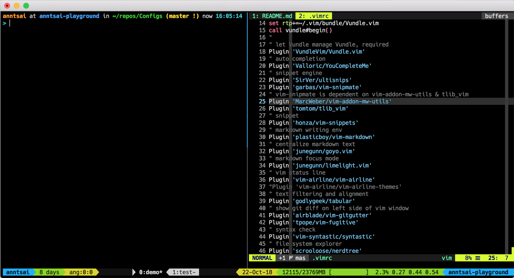

# Configs
:star: Star this repository if you like it! :tada: :blush:


## Notable features
### shell prompt
- current user
- current machine
- current directory
- current Git branch and status if available
- current time

### vim
- Plugins for
  - Auto completion: YouCompleteMe
  - Snippet: ultisnips+vim-snipmate (engine) + vim-snippets (snippet)
  - Markdown: vim-markdown, goyo.vim, limelight.vim
  - Status line: vim-airline
  - Auto tab: tabular
  - Git related: vim-gitgutter, vim-fugitive, nerdtree-git-plugin
  - Syntax check: syntastic
  - File system explorer: NERDTree
  - Preview colours: vim-css-color
- Theme: Use [Luna-term](https://github.com/notpratheek/vim-luna/blob/master/colors/luna-term.vim)
- vim config to promote working efficiency
  - Show colorcolumn at 72 & 80 char location
  - **Auto reload when the file is changes somewhere**
  - **Remove trailing spaces when the file is saved**

### tmux
- Revised theme based on tmux-themepack
- Status line
  - current user
  - machine uptime
  - tmux session name:window_index:pane_index
  - cpu and memory load
  - datetime
  - date
  - machine name
- **Be able to store/restore tmux session even the machine is restarted**,
  see [key-bindings.md](key-bindings.md) to know how to use it!

To see commands and key bindings in this env, please see [commands.md](commands.md) & [key-bindings.md](key-bindings.md)

## Envoriment set up
You can get the same envinorment by running [run_envSet.sh](run_envSet.sh) (for bash),
when you run the script,
please **make sure** you have [ColorEcho.bash](https://github.com/PeterDaveHello/ColorEchoForShell/blob/master/dist/ColorEcho.bash) (for colored output) and load it `. ColorEcho.bash`.

Otherwise, it can't work well.

But don't worry, it should be working because it's downloaded and loaded in run_envSet.sh

If you want, you can also choose output without color,
just replace `echo.*` with normal `echo`

```shell
./run_envSet.sh
```

### What to install
- Common apt packages: `tmux`, `wget`, `curl`, etc
- Dot files: `.bashrc`, `.tmux.conf`, `.vimrc`, etc
- nvm, npm and node
- My [Tools](https://github.com/extend1994/Tools) repo for working efficiency
- Optional
  - [fzf command-line fuzzy finder](https://github.com/junegunn/fzf): Find the useful Fuzzy completion for bash and zsh [here](https://github.com/junegunn/fzf#fuzzy-completion-for-bash-and-zsh)
  - cdnjs contributing environment

## hyper: A terminal built on web technologies
See https://hyper.is/

## References
`.bashrc`, `.gitconfig`, `.tmux.conf`, `.vimrc` are initiallly based on https://github.com/PeterDaveHello/Unitial.

* `less` highlight:
  * `sudo apt install libsource-highlight-common source-highlight`
  * ```shell
    export LESSOPEN="| /usr/share/source-highlight/src-hilite-lesspipe.sh %s"
    export LESS=" -R "
    ```
* .bashrc: Bash prompt
  * https://coderwall.com/p/fasnya/add-git-branch-name-to-bash-prompt
  * http://xta.github.io/HalloweenBash/
  * https://blog.gtwang.org/linux/how-to-make-a-fancy-and-useful-bash-prompt-in-linux-1/
  * PS1
    * `\e`: Turn on color
    * [SGR parameter](https://bit.ly/2K4Foq4)
      * `1`: Bold
      * 256-color mode: `38;5;#m`
* .vimrc
  * [Vundle](https://github.com/VundleVim/Vundle.vim): the plug-in manager for Vim
  * color sheme:
    * [Collected themes on official website](http://www.vim.org/scripts/script_search_results.php?keywords=&script_type=color+scheme&order_by=creation_date&direction=descending&search=search)
    * http://vimcolors.com
      * [vim-material](http://vimcolors.com/679/vim-material/dark)
      * [luna](http://vimcolors.com/414/luna/dark)
      * [blackboard](http://vimcolors.com/280/blackboard/dark)
      * [seti](http://vimcolors.com/244/seti/dark)
      * [kolor](http://vimcolors.com/91/kolor/dark)
      * [jellybeans](http://vimcolors.com/1/jellybeans/dark)
    * [vim-colorschemes](https://github.com/flazz/vim-colorschemes)
 * less
   * https://www.gnu.org/software/src-highlite/
   * http://liyangliang.me/posts/2013/11/less-with-syntax-highlight-and-line-number/
